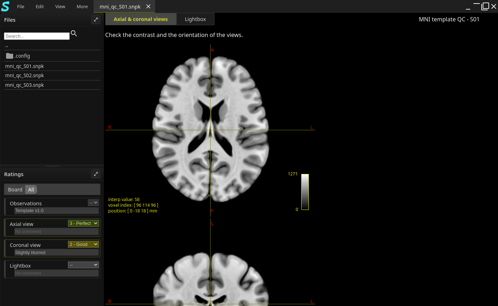
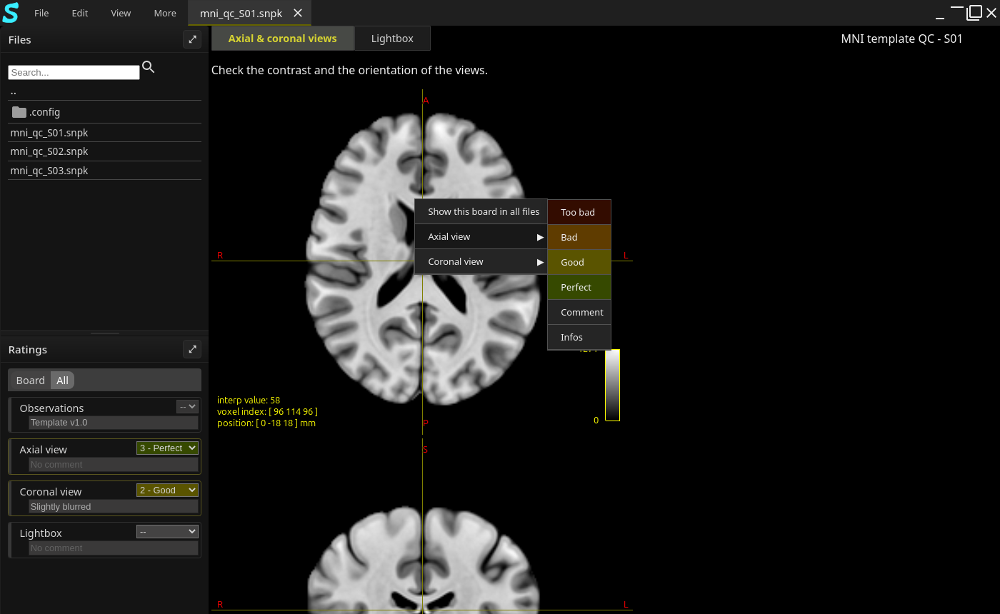

.. _user_guide:

==========
User guide
==========

This guide explains how to review snaps with the SnapCheck application. To create snaps, see the
:doc:`developers documentation <developers/snapcheck>`.

.. contents:: Contents
   :local:
   :depth: 1

Install and start SnapCheck (GUI)
=================================

SnapCheck is distributed as a conda package, ``snapclient``, published in a conda channel (a
*forge*). Install it with `pixi <https://pixi.sh>`_:

.. code-block:: shell

   pixi global install -c <forge> -c https://prefix.dev/conda-forge snapclient

This installs the ``snapcheck`` command, which starts the application:

.. code-block:: shell

   snapcheck

The application is made of two programs: a backend, which reads and writes the snap files, and the
window, which displays them. The ``snapcheck`` command starts both, and stops the backend when the
window is closed. They communicate through local network ports, which can be changed if they are
already used:

.. code-block:: shell

   snapcheck --backend-port 8060 --frontend-port 3050

======================= ============= ======================================================
Option                  Default       Description
======================= ============= ======================================================
``--host``              ``127.0.0.1`` Host of the backend and of the window content.
``--backend-port``      ``8050``      Port of the backend.
``--frontend-port``     ``3000``      Port serving the window content.
``--secret``            random        Key used to sign the authentication tokens (or
                                      ``$SNAP_SECRET``).
======================= ============= ======================================================

The window
==========

The window is made of:

- **the top bar**: the menus, the tabs of the opened snaps and the buttons to minimize, maximize
  and close the window. Drag the top bar to move the window, double-click it to maximize the
  window;
- **the side panel**, on the left, with two sections: *Files* to open the snaps and *Ratings* to
  rate. Drag the bar between the sections to resize them, or use the button of a section header to
  maximize it. Hide or show the panel with :menuselection:`View --> Show Sidebar`;
- **the board area**: the list of the boards of the snap, then the current board.

Open a snap
===========

In the *Files* section of the side panel, go to the directory of the snap: click a directory to
open it, ``..`` to go to the parent directory, or the path at the top to go back to a parent
directory. The sub-directories are listed first, then the files. Type in the search field to filter
the listed items. **Double-click** a ``.snpk`` file to open it.

Each opened snap has its own tab in the top bar, named after its file: click a tab to display its
snap, or its cross to close it. The name of a snap which has unsaved modifications ends with a
``*``. The title of the snap is displayed above the board.

.. note::

   An image can also be opened: SnapCheck then creates an untitled snap displaying it, to review it
   quickly.

Review the boards
=================

The boards of the snap are listed above the board area: click a board to display it, or press
:kbd:`Tab` to go to the next board (after the last board, it goes back to the first one).

Use the mouse wheel to zoom in the board, and drag it to move it.

Each board comes with instructions for the reviewer, and each element of the board indicates the
ratings to fill in by looking at it.

Rate
====

The *Ratings* section of the side panel lists the ratings of the snap. For each rating:

- choose a value in the list: its color indicates the chosen level;
- type a comment in the field below it. The comment is recorded when the field loses the focus
  (click elsewhere).

The switch at the top of the section chooses the listed ratings: *Board* lists only the ratings
of the current board, *All* lists all the ratings of the snap and highlights the ones of the
current board.

A rating can also be set with a **right click** on an element of the board: the menu lists the
ratings of the board, and for each one the levels of its scale.

Some ratings have no scale: they are only used to write a comment.

Save and export
===============

- :menuselection:`File --> Save` saves the snap in its file. It is only available when the snap
  has unsaved modifications.
- :menuselection:`File --> Save As...` saves the snap in another file: type its path.
- :menuselection:`File --> Export to HTML` exports the snap as a static website, which can be
  opened with any web browser: choose the directory where the website is written, then click
  *Export*. The home page of the website is ``00_INDEX.html``, with a page per board showing the
  ratings.

The ratings are saved in the snap file itself: to gather the results of many snaps, read them with
the ``snapcheck`` python package (see :func:`snapcheck.snap.snap.load_snap`).

Mouse and keyboard
==================

================================== ==================================================
Action                             Effect
================================== ==================================================
:kbd:`Tab`                         Go to the next board.
Mouse wheel on the board           Zoom in or out.
Drag the board                     Move the board.
Right click on an element          Rate the element.
Double-click a file                Open the snap.
Drag the top bar                   Move the window.
Double-click the top bar           Maximize or restore the window.
================================== ==================================================

Settings
========

The settings are stored in ``~/.config/snapcheck/settings.json``, created at the first start:

=========================== ==============================================================
Setting                     Description
=========================== ==============================================================
``files.default_path``      Directory displayed by the *Files* section at startup
                            (default: the home directory).
``files.extensions``        Extensions of the files to list (default: ``.snpk``). Not used yet:
                            all the files are listed.
``files.n_history``         Number of recent files to remember (default: 20).
``core.share_dir``          Directory where the application stores its persistent data
                            (default: ``~/.local/share/snapcheck``).
=========================== ==============================================================

The *About* page (:menuselection:`More --> About`) gives the link to the source code.
